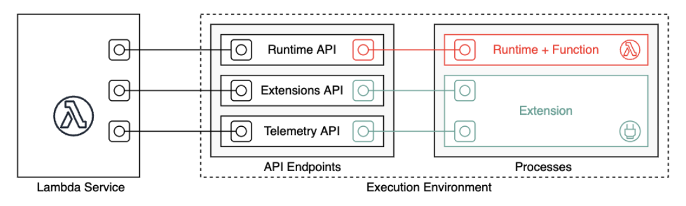
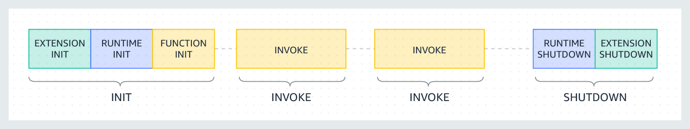

Resources
---

- Memory (RAM): 128MB -> 10.240MB in 1MB increments
- CPU: depends on memory
- Execution time: default 3s -> 15min
- Storage: 512MB included. Add from 512MB -> 10.240MB in 1MB increments
- Execution environment ([custom](https://docs.aws.amazon.com/lambda/latest/dg/lambda-runtime-environment.html))



- Lambda lifecycle



<!-- end_slide -->

Costs
---

Lambda invocation eu-west-3 x86 architecture.

[Lambda pricing invocation table:](https://aws.amazon.com/lambda/pricing/)

| Memory MB | Price U$   |
| ------ | ------------- |
| 128    | 2,10 (1M/sec) |
| 256    | 8,30 (1M/sec) | 
| 2048   | 0,03 (1K/sec) |
| 10.240 | 0,17 (1K/sec) |

<!-- end_slide -->

Applications
---

- Batch processing
- Real-time data processing
- Backends
- Cron tasks
- Triggered tasks (SNS, SQS, etc.)
- ...

<!-- end_slide -->

Why?
---

# Advantages

- No server to manage
- Pay-as-you-go
- Scales automagically
- Integration eco-system
- Runtimes (default): Go, Java, Python, Ruby, Typescript and linux (Rust, php, etc.)
- Integrates with IAM (trigger URL), 

<!-- pause -->

# Disadvantages

- Timeout 15m
- Cold start latency: 100ms - 300ms
- Stateless, for persistence Dynamo, S3, RDS, ElastiCache
- 1k concurrent executions
- Vendor lock-in (event handlingh)

<!-- end_slide -->


Initialization
---


- **Generate event**: `sam local generate-event`
- **Invoke**: `sam local invoke <handler-name> --event <file/path.json> --env-vars <file/path.json>`
    - [`--env-vars`](https://docs.aws.amazon.com/serverless-application-model/latest/developerguide/serverless-sam-cli-using-invoke.html#serverless-sam-cli-using-invoke-environment-file)

<!-- pause -->

---

<!-- column_layout: [3, 5, 2] -->

<!-- column: 0 -->

`handler`

```python +no_background
import os
import json
import cv2
import logging
import boto3

s3 = boto3.client('s3')
logger = logging.getLogger()
logger.setLevel(logging.INFO)

def lambda_handler(event, context):

  # Handler logic...

```

<!-- pause -->

<!-- column: 1 -->

`event`

```json +no_background
{
  "Records": [
    {
      "messageId": "19dd0b57-b21e-4ac1-bd88-01bbb068cb78",
      "receiptHandle": "MessageReceiptHandle",
      "body": "hello world",
      "attributes": {
        "ApproximateReceiveCount": "1",
        "SentTimestamp": "1523232000000",
        "SenderId": "123456789012",
        "ApproximateFirstReceiveTimestamp": "1523232000001"
      },
      "messageAttributes": {},
      "md5OfBody": "49dfdd54b01cbcd2d2ab5e9e5ee6b9b9",
      "eventSource": "aws:sqs",
      "eventSourceARN": "arn:aws:sqs:us-east-1:123456789012:MyQueue",
      "awsRegion": "us-east-1"
    }
  ]
}
```

<!-- pause -->

<!-- column: 2 -->

`context`

- **function_name**
- **function_version**
- **invoked_function_arn**
- **memory_limit_in_mb**
- **aws_request_id**
- **log_group_name**
- **log_stream_name**
- **identity**
- **cognito_identity_id**
- **cognito_identity_pool_id**
- **client_context**
- **custom**
- **env**

<!-- end_slide -->

References
---

# Tooling

- [ckd cli](https://aws.amazon.com/cli/)
- [sam cli - local testing](https://docs.aws.amazon.com/serverless-application-model/latest/developerguide/install-sam-cli.html)
- [AWS toolkit - VSCode plugin](https://marketplace.visualstudio.com/items?itemName=AmazonWebServices.aws-toolkit-vscode)
- [docker](https://docs.docker.com/engine/install/)

# Resources

- [Step Function Workshop](https://catalog.us-east-1.prod.workshops.aws/workshops/9e0368c0-8c49-4bec-a210-8480b51a34ac/en-US)
- [Powertools workshop](https://catalog.workshops.aws/powertools-for-aws-lambda/en-US/003-workshop/002-typescript/module2)
    - [js](https://middy.js.org/docs/integrations/lambda-powertools/)
    - [python](https://docs.powertools.aws.dev/lambda/python/latest/)

<!-- end_slide -->
